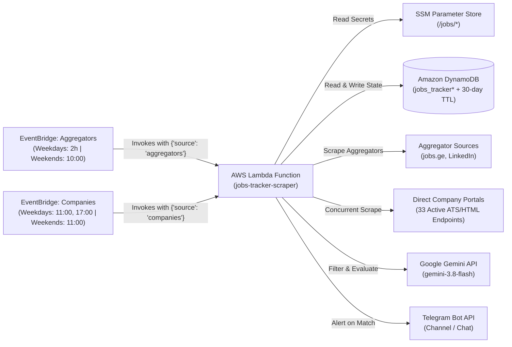

# AWS Serverless Deployment Guide

This guide provides complete instructions for deploying the **Mestvire** job vacancy monitoring system to Amazon Web Services (AWS) using a fully serverless, highly available, and cost-effective architecture.

The entire setup operates well within the **AWS Free Tier** ($0/month ongoing cost under normal operating loads).

---

## Architecture Overview



### AWS Components

| Component | AWS Service | Purpose | Configuration |
| :--- | :--- | :--- | :--- |
| **State Tracking** | Amazon DynamoDB | Prevents duplicate alerts across runs | Partition key: `source`, Sort key: `job_id`, On-Demand billing, 30-day auto-TTL on `expire_at` |
| **Secrets Management** | AWS Systems Manager (SSM) Parameter Store | Securely stores API keys and bot tokens | Parameters under `/jobs/` (`SecureString` and `String`) |
| **Execution Engine** | AWS Lambda | Executes scrapers, LLM evaluation, and notifications | Python 3.12, `x86_64`, 512 MB memory, 300s timeout |
| **Access Control** | AWS IAM | Grants least-privilege permissions | Custom role `JobsScraperLambdaRole` |
| **Scheduler** | Amazon EventBridge | Triggers Lambda periodically on weekday and weekend schedules | **Aggregators Weekdays**: `cron(0 6,8,10,12,14,16,18 ? * MON-FRI *)` (every 2h from 10:00 to 22:00 Tbilisi)<br/>**Companies Weekdays**: `cron(0 7,13 ? * MON-FRI *)` (twice daily at 11:00 and 17:00 Tbilisi)<br/>**Aggregators Weekends**: `cron(0 6 ? * SAT-SUN *)` (once daily at 10:00 AM Tbilisi)<br/>**Companies Weekends**: `cron(0 7 ? * SAT-SUN *)` (once daily at 11:00 AM Tbilisi) |
| **Observability** | Amazon CloudWatch Logs | Stores execution logs and error traces | Log group `/aws/lambda/jobs-tracker-scraper`, 14-day retention |

---

## Prerequisites

Before starting deployment, ensure the following are available on your system:

1. **AWS CLI (v2)**: Installed and added to `PATH` ([Install AWS CLI](https://docs.aws.amazon.com/cli/latest/userguide/getting-started-install.html)).
2. **AWS Credentials**: Authenticated with an active profile:
   - **IAM User / Access Keys**: Run `aws configure`
   - **AWS IAM Identity Center (SSO)**: Run `aws sso login --profile <your-profile>`
   - The user/role must have permissions to manage IAM, DynamoDB, SSM, Lambda, EventBridge, and CloudWatch.
3. **Python 3.12+**: Required for packaging dependencies.
4. **Local `.env` file**: Configured with your actual tokens and chat IDs:
   ```env
   TELEGRAM_BOT_TOKEN=your_telegram_bot_token
   TELEGRAM_CHAT_ID=your_telegram_chat_id
   GEMINI_API_KEY=your_gemini_api_key
   ```
5. **PowerShell Execution Policy** *(Windows only)*:
   If running PowerShell scripts for the first time, allow script execution in your session:
   ```powershell
   Set-ExecutionPolicy -Scope Process -ExecutionPolicy Bypass
   ```

---

## Automated Deployment (Recommended)

The repository provides automated deployment scripts for both Windows PowerShell and Linux/macOS Bash.

### Step 1: Build the Linux Lambda Package
AWS Lambda runs on Amazon Linux. Dependencies must be packaged using Linux-compatible binaries (`manylinux2014_x86_64`).

Run the automated packaging tool from the project root:
```bash
python scripts/package_lambda.py
```
This builds `deployment_package.zip` containing all production dependencies, source modules (`src/`), entrypoint `lambda_function.py`, and automatically packages `data/companies_manifest.yaml` into the `data/` directory of the zip bundle.

### Step 2: Run the Deployment Script

#### On Windows (PowerShell):
```powershell
# Using default profile and default region (eu-central-1):
.\scripts\deploy_aws.ps1

# Or with custom profile and region:
.\scripts\deploy_aws.ps1 -AwsProfile "my-profile" -Region "eu-central-1"
```

#### On Linux / macOS (Bash):
```bash
# Ensure executable permissions:
chmod +x scripts/deploy_aws.sh

# Using default profile and default region (eu-central-1):
./scripts/deploy_aws.sh

# Or with custom profile and region:
./scripts/deploy_aws.sh --profile "my-profile" --region "eu-central-1"
```

The script automatically:
- Creates the DynamoDB table `jobs_tracker` and enables 30-day TTL on `expire_at`.
- Loads secrets from `.env` and stores them in SSM Parameter Store (`/jobs/*`).
- Provisions the IAM role `JobsScraperLambdaRole` with least-privilege access policies (allowing table wildcarding `jobs_tracker*`).
- Deploys `deployment_package.zip` to AWS Lambda with optimal runtime settings.
- Configures CloudWatch log retention to 14 days.
- Sets up dual EventBridge rate rules (`jobs-tracker-aggregators-2h` and `jobs-tracker-companies-6h`) and attaches invoke permissions.

---

## Manual Step-by-Step Provisioning

If you prefer to provision AWS resources manually via the AWS Management Console or custom Infrastructure as Code (Terraform / CloudFormation), follow the steps below.

### 1. Amazon DynamoDB Table
1. Navigate to **DynamoDB** in the AWS Console (Region: `eu-central-1`).
2. Click **Create table**:
   - **Table name**: `jobs_tracker`
   - **Partition key**: `source` (Type: `String`)
   - **Sort key**: `job_id` (Type: `String`)
   - **Table settings**: Select **Customize settings**
   - **Read/write capacity settings**: Select **On-demand** (`PAY_PER_REQUEST`).
3. Once created, select the table, open the **Additional settings** tab:
   - Under **Time to Live (TTL)**, click **Turn on**.
   - **TTL attribute name**: `expire_at`
   - Save changes. Items will now automatically expire 30 days after being seen.

### 2. AWS Systems Manager (SSM) Parameter Store
1. Navigate to **AWS Systems Manager** > **Parameter Store**.
2. Create the following parameters:

| Name | Type | Value |
| :--- | :--- | :--- |
| `/jobs/telegram_bot_token` | `SecureString` | Your Telegram bot token from `@BotFather` |
| `/jobs/telegram_chat_id` | `String` | Target Telegram chat or channel ID |
| `/jobs/gemini_api_key` | `SecureString` | Your Google Gemini API Key |
| `/jobs/filter_senior_roles` | `String` *(Optional)* | `"true"` (default) |

### 3. IAM Execution Role
1. Navigate to **IAM** > **Roles** > **Create role**.
2. Select **AWS service** as the trusted entity type, and choose **Lambda** as the use case.
3. Attach the AWS managed policy:
   - `AWSLambdaBasicExecutionRole` (allows writing logs to CloudWatch).
4. Name the role: **`JobsScraperLambdaRole`**.
5. Once created, open the role, click **Add permissions** > **Create inline policy**, choose JSON view, and paste:

```json
{
  "Version": "2012-10-17",
  "Statement": [
    {
      "Sid": "DynamoDBAccess",
      "Effect": "Allow",
      "Action": [
        "dynamodb:GetItem",
        "dynamodb:PutItem",
        "dynamodb:DescribeTable"
      ],
      "Resource": "arn:aws:dynamodb:*:*:table/jobs_tracker*"
    },
    {
      "Sid": "SSMParameterAccess",
      "Effect": "Allow",
      "Action": [
        "ssm:GetParameters",
        "ssm:GetParameter",
        "ssm:GetParametersByPath"
      ],
      "Resource": "arn:aws:ssm:*:*:parameter/jobs/*"
    },
    {
      "Sid": "KMSDecryptAccess",
      "Effect": "Allow",
      "Action": [
        "kms:Decrypt"
      ],
      "Resource": "*"
    }
  ]
}
```
6. Name the inline policy **`JobsScraperPolicy`** and click **Create policy**.

### 4. AWS Lambda Function
1. Navigate to **AWS Lambda** > **Create function**.
2. Settings:
   - **Function name**: `jobs-tracker-scraper`
   - **Runtime**: `Python 3.12`
   - **Architecture**: `x86_64`
   - **Execution role**: Choose an existing role -> `JobsScraperLambdaRole`.
3. Under **Configuration**:
   - **General configuration**:
     - **Memory**: `512 MB`
     - **Timeout**: `5 min 0 sec` (300 seconds)
   - **Environment variables**:
     - `DYNAMODB_TABLE_NAME`: `jobs_tracker`
     - `SSM_PREFIX`: `/jobs`
     - `FILTER_SENIOR_ROLES`: `true`
4. Under **Code**:
   - Click **Upload from** > **.zip file** and select `deployment_package.zip`.
   - Ensure **Runtime settings** handler is set to `lambda_function.lambda_handler`.

### 5. Amazon EventBridge Scheduler
The scraper runs on a targeted 4-rule architecture to balance fresh vacancy discovery on fast-moving aggregators with efficient company career portal scraping across weekdays and weekends:

#### Rule 1: Aggregators Weekdays (`jobs-tracker-aggregators-weekdays`)
Monitors `jobs.ge` and `LinkedIn` every 2 hours between 10:00 and 22:00 Tbilisi Time (Monday to Friday):
1. Go to **Amazon EventBridge** > **Rules** > **Create rule**.
2. **Name**: `jobs-tracker-aggregators-weekdays`
3. **Rule type**: Schedule
4. **Schedule pattern**: Cron expression: `0 6,8,10,12,14,16,18 ? * MON-FRI *`
5. **Target**:
   - Target type: **AWS service**
   - Service: **Lambda function**
   - Function: `jobs-tracker-scraper`
   - Expand **Additional settings** > **Configure target input** > Select **Constant (JSON text)**:
     ```json
     {"source": "aggregators"}
     ```

#### Rule 2: Companies Weekdays (`jobs-tracker-companies-weekdays`)
Monitors all 33 direct company career portals twice daily at 11:00 AM and 5:00 PM (17:00) Tbilisi Time / 07:00, 13:00 UTC (Monday to Friday):
1. **Name**: `jobs-tracker-companies-weekdays`
2. **Rule type**: Schedule
3. **Schedule pattern**: Cron expression: `0 7,13 ? * MON-FRI *`
4. **Target**:
   - Function: `jobs-tracker-scraper`
   - Target input:
     ```json
     {"source": "companies"}
     ```

#### Rule 3: Aggregators Weekends (`jobs-tracker-aggregators-weekends`)
Monitors `jobs.ge` and `LinkedIn` once daily at 10:00 AM Tbilisi Time (Saturday and Sunday):
1. **Name**: `jobs-tracker-aggregators-weekends`
2. **Rule type**: Schedule
3. **Schedule pattern**: Cron expression: `0 6 ? * SAT-SUN *`
4. **Target**:
   - Function: `jobs-tracker-scraper`
   - Target input:
     ```json
     {"source": "aggregators"}
     ```

#### Rule 4: Companies Weekends (`jobs-tracker-companies-weekends`)
Monitors all 33 direct company career portals once daily at 11:00 AM Tbilisi Time / 07:00 UTC (Saturday and Sunday, providing 1-hour staggered separation from aggregators):
1. **Name**: `jobs-tracker-companies-weekends`
2. **Rule type**: Schedule
3. **Schedule pattern**: Cron expression: `0 7 ? * SAT-SUN *`
4. **Target**:
   - Function: `jobs-tracker-scraper`
   - Target input:
     ```json
     {"source": "companies"}
     ```

---

## Verification & Testing

### 1. Test Invocation via AWS CLI
You can invoke the deployed Lambda function in test mode (scrapes listings, evaluates the first matching vacancy, sends a Telegram notification preview, but skips database writes):

#### Test Aggregators (jobs.ge & LinkedIn)
```bash
aws lambda invoke \
    --function-name jobs-tracker-scraper \
    --payload '{"test": true, "source": "aggregators"}' \
    --cli-binary-format raw-in-base64-out \
    --region eu-central-1 response.json
```

#### Test Company Career Boards (Direct Portals)
```bash
aws lambda invoke \
    --function-name jobs-tracker-scraper \
    --payload '{"test": true, "source": "companies"}' \
    --cli-binary-format raw-in-base64-out \
    --region eu-central-1 response.json
```

View the execution result:
```bash
# Windows PowerShell:
Get-Content response.json

# Linux / macOS:
cat response.json
```

Expected output (illustrating company stats):
```json
{
  "statusCode": 200,
  "headers": { "Content-Type": "application/json" },
  "body": "{\"status\": \"success\", \"requestId\": \"...\", \"source\": \"companies\", \"is_test\": true, \"stats\": {\"epam\": {\"total_scraped\": 15, \"new_matched\": 1, \"processed\": 1, \"senior_skipped\": 0, \"errors\": 0}, \"tbc_bank\": {\"total_scraped\": 8, \"new_matched\": 1, \"processed\": 1, \"senior_skipped\": 0, \"errors\": 0}, \"bank_of_georgia\": {\"total_scraped\": 12, \"new_matched\": 0, \"processed\": 0, \"senior_skipped\": 1, \"errors\": 0}}}"
}
```

### 2. View CloudWatch Logs
To stream live execution logs from CloudWatch:
```bash
aws logs tail "/aws/lambda/jobs-tracker-scraper" --follow --region eu-central-1
```

Or view them in the AWS Management Console under **CloudWatch** > **Log groups** > `/aws/lambda/jobs-tracker-scraper`.

---

## Updating & Maintenance

### Updating Application Code
When making changes to scraper logic, LLM prompts, or filters:
1. Re-package the application:
   ```bash
   python scripts/package_lambda.py
   ```
2. Upload the new code:
   ```bash
   aws lambda update-function-code \
       --function-name jobs-tracker-scraper \
       --zip-file fileb://deployment_package.zip \
       --region eu-central-1
   ```
   *(Or simply re-run `.\scripts\deploy_aws.ps1` or `./scripts/deploy_aws.sh`, which automatically detects the existing function and updates both code and configuration).*

### Updating Secrets & API Keys
To update your Telegram bot token, chat ID, or Gemini API key without touching code:
```bash
aws ssm put-parameter --name "/jobs/telegram_bot_token" --value "NEW_TOKEN" --type "SecureString" --overwrite --region eu-central-1
aws ssm put-parameter --name "/jobs/telegram_chat_id" --value "NEW_CHAT_ID" --type "String" --overwrite --region eu-central-1
aws ssm put-parameter --name "/jobs/gemini_api_key" --value "NEW_KEY" --type "SecureString" --overwrite --region eu-central-1
```
The Lambda function will automatically pick up the new values on its next execution.

---

## Troubleshooting

| Issue | Cause | Resolution |
| :--- | :--- | :--- |
| `ResourceConflictException` during add-permission | Permission statement already exists | Safe to ignore; the deployment scripts catch and suppress this automatically. |
| `cannot be assumed by Lambda` on function creation | IAM role replication delay | Wait 10–15 seconds for IAM changes to propagate globally across AWS. Automated scripts retry up to 6 times. |
| Lambda times out after 3 seconds | Default Lambda timeout (3s) was not updated | Ensure timeout is set to `300` seconds (5 minutes) in function configuration. |
| `ImportError: cannot import name ...` | Package contains Windows `.pyd` binaries instead of Linux `.so` | Always build `deployment_package.zip` using `python scripts/package_lambda.py`, which downloads `manylinux2014_x86_64` wheels. |
| Secrets return `YOUR_BOT_TOKEN` | Local `.env` file was missing during automated deployment | Populate `.env` with actual values and re-run deployment script, or update SSM Parameter Store manually. |
