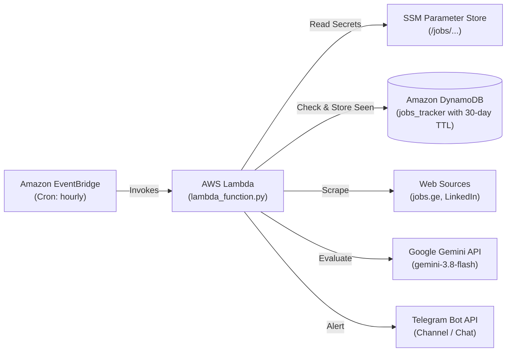

# Mestvire: Data Roles Monitor & Alerting System

Automated multi-source job vacancy monitoring and AI-powered evaluation pipeline for **Data Engineering**, **Data Analytics**, and **Business Intelligence** roles in Georgia. Evaluates vacancies using Google Gemini (in Georgian) and delivers instant alerts to Telegram. Supports Amazon DynamoDB with a 30-day TTL for state tracking and AWS SSM Parameter Store for secure configuration.

---

## Architecture Overview



---

## Project Structure

```
Mestvire/
├── .env.example                 # Configuration template
├── .gitignore                   # Ignores credentials, venv, caches, and build artifacts
├── README.md                    # Project documentation
├── requirements.txt             # Production runtime dependencies
├── lambda_function.py           # AWS Lambda entrypoint handler
├── app.py                       # Local CLI runner / continuous monitor
├── AWS_DEPLOYMENT.md            # AWS Deployment guide & step-by-step instructions
│
├── src/                         # Core application package
│   ├── __init__.py              # Central package exports
│   ├── config.py                # App configuration, logging & AWS SSM parameter resolution
│   ├── database.py              # Amazon DynamoDB persistence & 30-day TTL management
│   ├── filters.py               # Keyword matching & senior title negative filters
│   ├── llm.py                   # Google Gemini evaluation, prompt builder & retry backoff
│   ├── notifier.py              # Telegram HTML formatting & alert dispatching
│   ├── pipeline.py              # Scraper registry & execution pipeline orchestrator
│   ├── utils.py                 # Shared utilities: clean_text & Georgian date parsing
│   │
│   ├── scrapers/                # Modular scrapers subpackage
│   │   ├── __init__.py          # Scraper exports
│   │   ├── jobsge.py            # jobs.ge listing & detail scraper
│   │   └── linkedin.py          # LinkedIn guest search & detail scraper
│   │
│   ├── scraper.py               # Backwards-compatibility facade for jobsge scraper
│   └── linkedin_scraper.py      # Backwards-compatibility facade for linkedin scraper
│
├── tests/                       # Unit tests & verification
│   ├── __init__.py
│   ├── conftest.py              # Pytest & path setup
│   ├── run_all_tests.py         # One-command runner for all test suites
│   ├── test_config_ssm.py       # SSM & config resolution tests
│   ├── test_database_dynamodb.py# DynamoDB schema, TTL & queries tests
│   ├── test_lambda_function.py  # Lambda handler & modular registry tests
│   ├── test_llm.py              # Gemini prompt, retry backoff & rate limit tests
│   └── test_senior_filter.py    # Title filtering, date cutoff & DB skip tests
│
└── scripts/                     # Automation & deployment tooling
    └── package_lambda.py        # Cross-platform packaging script for deployment_package.zip
```

---

## Local Development & Quickstart

### 1. Environment Setup
```bash
python -m venv .venv
source .venv/bin/activate  # On Windows: .venv\Scripts\activate
pip install -r requirements.txt
cp .env.example .env
```
Fill in your `TELEGRAM_BOT_TOKEN`, `TELEGRAM_CHAT_ID`, and `GEMINI_API_KEY` in `.env`.
For isolated local testing, keep `DYNAMODB_TABLE_NAME="jobs_tracker_dev"` in `.env` so local runs don't overwrite production state.

### 2. Run Tests
```bash
python tests/run_all_tests.py
```

### 3. Local CLI Execution
```bash
# Test single vacancy evaluation from jobs.ge
python app.py --test jobsge

# Test single vacancy evaluation from LinkedIn
python app.py --test linkedin

# Run single scan for all sources
python app.py

# Run continuous monitoring loop (every 5 minutes)
python app.py --loop --interval 300
```

### 4. Test AWS Lambda Handler Locally
```bash
python lambda_function.py
```

---

## AWS Deployment

See [`AWS_DEPLOYMENT.md`](AWS_DEPLOYMENT.md) for full step-by-step instructions on provisioning:
1. Amazon DynamoDB (`jobs_tracker` with TTL on `expire_at`).
2. AWS SSM Parameter Store (`/jobs/telegram_bot_token`, `/jobs/telegram_chat_id`, `/jobs/gemini_api_key`).
3. IAM execution role (`JobsScraperLambdaRole`).
4. AWS Lambda function (`jobs-tracker-scraper`).
5. Amazon EventBridge cron schedules (weekdays & weekends).

### Quick Deployment

1. **Package the Lambda bundle**:
```bash
python scripts/package_lambda.py
```

2. **Deploy to AWS**:
- On Windows: `.\scripts\deploy_aws.ps1`
- On Linux / macOS: `./scripts/deploy_aws.sh`
