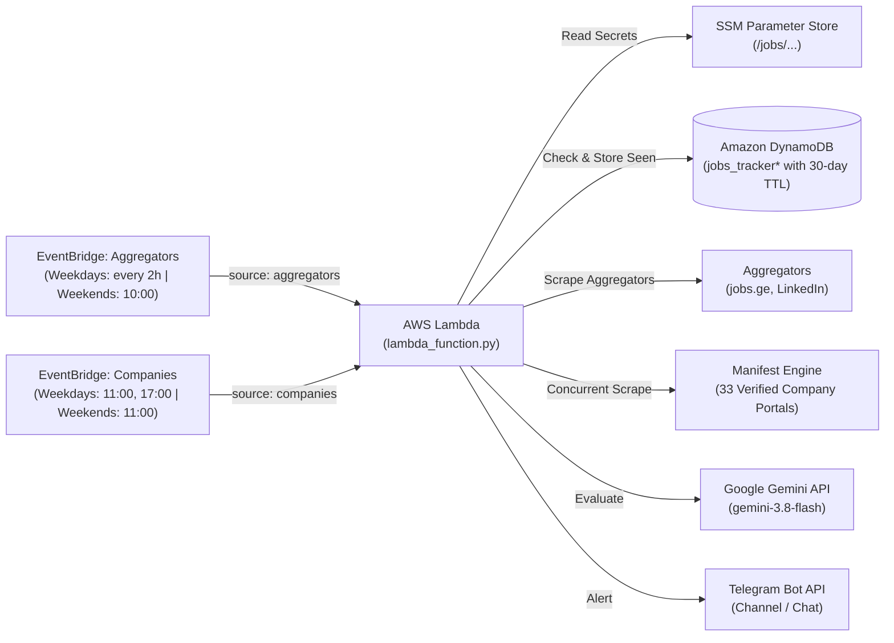

# Mestvire: Data Roles Monitor & Alerting System

Automated multi-source job vacancy monitoring and AI-powered evaluation pipeline for **Data Engineering**, **Data Analytics**, and **Business Intelligence** roles in Georgia. Evaluates vacancies using Google Gemini (in Georgian) and delivers instant alerts to Telegram. Supports Amazon DynamoDB with a 30-day TTL for state tracking and AWS SSM Parameter Store for secure configuration.

Mestvire monitors both general job aggregators (**jobs.ge**, **LinkedIn**) and **33 direct verified company career portals** (leading banks, fintech, telecom, and enterprise tech hubs) using a high-performance declarative manifest engine (`manifest_engine.py`) with concurrent execution and automated ATS API/HTML extraction.

---

## Architecture Overview



---

## Project Structure

```
Mestvire/
├── .env.example                 # Configuration template
├── .gitignore                   # Ignores credentials, venv, caches, and build artifacts
├── README.md                    # Project documentation
├── requirements.txt             # Production runtime dependencies (includes PyYAML)
├── lambda_function.py           # AWS Lambda entrypoint handler
├── app.py                       # Local CLI runner / continuous monitor
├── AWS_DEPLOYMENT.md            # AWS Deployment guide & step-by-step instructions
│
├── data/                        # Declarative configuration manifests
│   └── companies_manifest.yaml  # Declarative YAML manifest configuring 33 active verified company endpoints, selectors & ATS APIs
│
├── src/                         # Core application package
│   ├── __init__.py              # Central package exports
│   ├── config.py                # App configuration, logging & AWS SSM parameter resolution
│   ├── database.py              # Amazon DynamoDB persistence & 30-day TTL management
│   ├── filters.py               # Keyword matching & senior title negative filters
│   ├── llm.py                   # Google Gemini evaluation, prompt builder & retry backoff
│   ├── notifier.py              # Telegram HTML formatting & alert dispatching
│   ├── pipeline.py              # Scraper registry & execution pipeline orchestrator
│   ├── utils.py                 # Shared utilities: clean_text & Georgian date parsing
│   │
│   ├── scrapers/                # Modular scrapers subpackage
│   │   ├── __init__.py          # Scraper exports
│   │   ├── jobsge.py            # jobs.ge listing & detail scraper
│   │   ├── linkedin.py          # LinkedIn guest search & detail scraper
│   │   └── manifest_engine.py   # Manifest-driven scraping engine with concurrent execution, ATS API handling & HTML parsing
│   │
│   ├── scraper.py               # Backwards-compatibility facade for jobsge scraper
│   └── linkedin_scraper.py      # Backwards-compatibility facade for linkedin scraper
│
├── tests/                       # Unit tests & verification
│   ├── __init__.py
│   ├── conftest.py              # Pytest & path setup
│   ├── run_all_tests.py         # One-command runner for all test suites
│   ├── test_config_ssm.py       # SSM & config resolution tests
│   ├── test_database_dynamodb.py# DynamoDB schema, TTL & queries tests
│   ├── test_lambda_function.py  # Lambda handler & modular registry tests
│   ├── test_llm.py              # Gemini prompt, retry backoff & rate limit tests
│   ├── test_senior_filter.py    # Title filtering, date cutoff & DB skip tests
│   └── test_manifest_engine.py  # Unit test suite for manifest engine
│
└── scripts/                     # Automation & deployment tooling
    ├── deploy_aws.ps1           # Automated AWS infrastructure deployment (PowerShell)
    ├── deploy_aws.sh            # Automated AWS infrastructure deployment (Bash)
    └── package_lambda.py        # Cross-platform packaging script for deployment_package.zip
```

---

## Local Development & Quickstart

### 1. Environment Setup
```bash
python -m venv .venv
source .venv/bin/activate  # On Windows: .venv\Scripts\activate
pip install -r requirements.txt
cp .env.example .env
```
> [!NOTE]
> `pyyaml` is included in `requirements.txt` to parse `data/companies_manifest.yaml` across local and serverless runtimes.

Fill in your `TELEGRAM_BOT_TOKEN`, `TELEGRAM_CHAT_ID`, and `GEMINI_API_KEY` in `.env`.
For isolated local testing, keep `DYNAMODB_TABLE_NAME="jobs_tracker_dev"` in `.env` so local runs don't overwrite production state.

### 2. Run Tests
```bash
python tests/run_all_tests.py
```

### 3. Local CLI Execution (`app.py`)
```bash
# Run aggregators only (jobs.ge & LinkedIn)
python app.py --source aggregators

# Run all 33 direct company career pages concurrently
python app.py --source companies

# Run a specific company by ID (e.g. epam, tbc_bank, bank_of_georgia)
python app.py --source epam
python app.py --source tbc_bank

# Run all sources (aggregators + all 33 direct companies)
python app.py --source all
# (or simply: python app.py)

# Test single vacancy evaluation from specific source (sends alert, skips DB write)
python app.py --test jobsge
python app.py --test linkedin
python app.py --test companies
python app.py --test epam

# Run continuous monitoring loop (every 5 minutes)
python app.py --loop --interval 300
```

### 4. Company Manifest Coverage & Transparency
The declarative manifest engine reads from `data/companies_manifest.yaml`:
- **48 Total Companies Configured**: Exhaustive catalog of major IT employers, financial institutions, and tech consultancies in the Georgian market.
- **33 Active Verified Targets (`manifest_ready: true`)**: Fully verified endpoints scraped concurrently across ATS APIs (SmartRecruiters, Lever, Workable, Recruitee, Greenhouse, internal REST/JSON APIs) and server-side static HTML portals (e.g. Bank of Georgia, TBC Bank, EPAM, Exactpro, Liberty Bank, Lineate, etc.).
- **15 Excluded Targets (`strategy_group: EXCLUDE`)**: Maintained in the manifest for roadmap visibility and future expansion, but currently excluded because they require full-browser automation (Playwright/Puppeteer) or ephemeral session tokens that exceed standard serverless Lambda constraints.

### 5. Test AWS Lambda Handler Locally
```bash
python lambda_function.py
```

---

## AWS Deployment

See [`AWS_DEPLOYMENT.md`](AWS_DEPLOYMENT.md) for full step-by-step instructions on provisioning:
1. Amazon DynamoDB (`jobs_tracker` with wildcard policy `jobs_tracker*` and TTL on `expire_at`).
2. AWS SSM Parameter Store (`/jobs/telegram_bot_token`, `/jobs/telegram_chat_id`, `/jobs/gemini_api_key`).
3. IAM execution role (`JobsScraperLambdaRole`).
4. AWS Lambda function (`jobs-tracker-scraper`).
5. Amazon EventBridge schedules: weekdays (aggregators every 2h from 10:00 to 22:00, companies twice daily at 11:00 and 17:00) and weekends (aggregators at 10:00 AM, companies at 11:00 AM Tbilisi time for 1-hour concurrency isolation).

### Quick Deployment

1. **Package the Lambda bundle**:
```bash
python scripts/package_lambda.py
```

2. **Deploy to AWS**:
- On Windows: `.\scripts\deploy_aws.ps1`
- On Linux / macOS: `./scripts/deploy_aws.sh`
